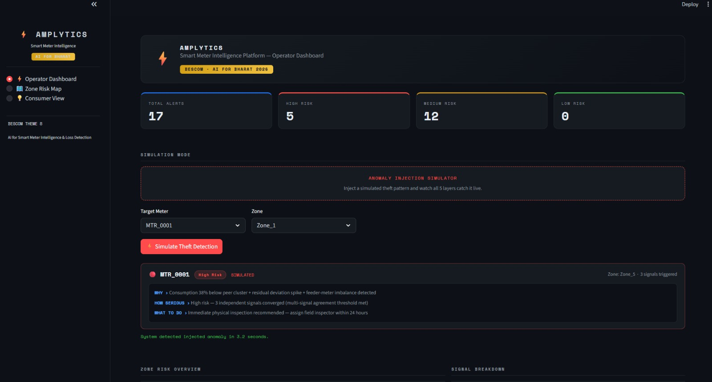
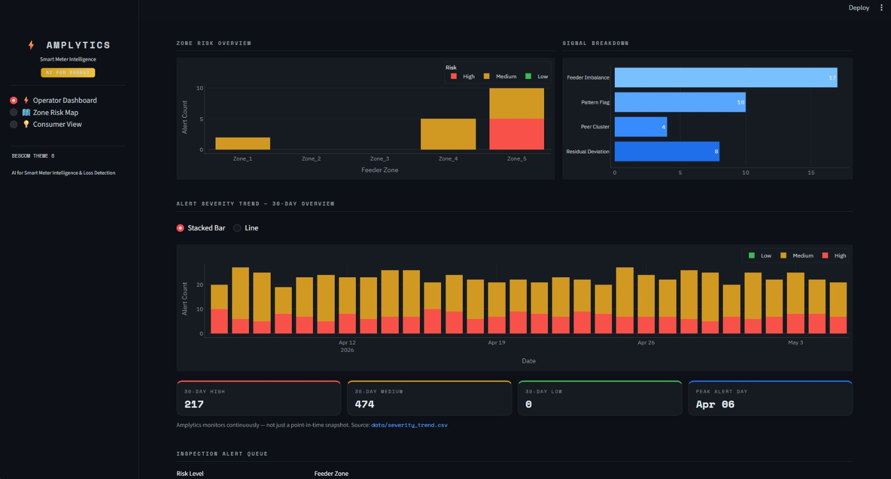
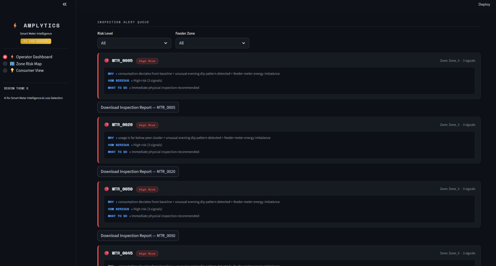
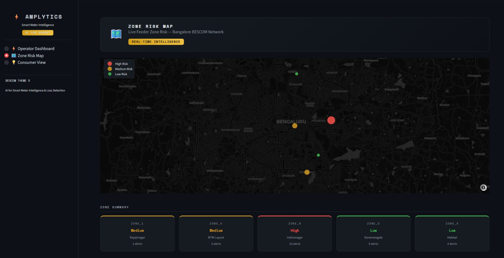
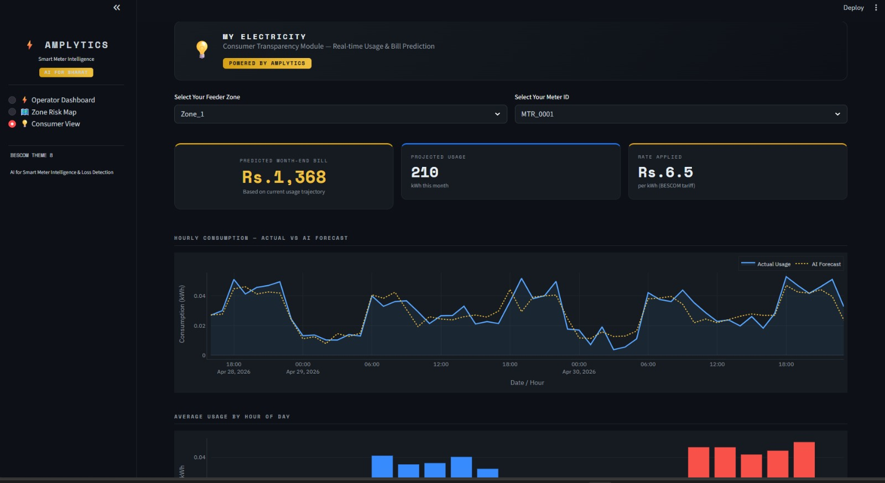

# Amplytics - Smart Meter Intelligence Platform

Amplytics is an AI-based smart meter intelligence demo for BESCOM-style electricity monitoring. It converts high-frequency meter readings into proactive insights for operators, inspectors, and consumers.

The platform generates synthetic smart meter data, detects possible theft/loss signals, fuses multiple anomaly indicators, explains inspection decisions, forecasts demand, and displays the outputs in a Streamlit dashboard.

## Problem Statement

BESCOM's smart meters generate high-frequency consumption data, but this data is often used as a reactive billing record instead of a proactive intelligence source.

This creates three major gaps:

- Operators have limited forward visibility into demand spikes and feeder stress.
- Revenue loss and possible theft can remain hidden until manual inspection or complaints.
- Consumers have limited visibility into their usage pattern and expected month-end bill.

Amplytics addresses this by adding a non-intrusive intelligence layer on top of existing smart meter data. It helps answer:

- What is happening in the network?
- Which meters or zones look risky?
- Why was a meter flagged?
- How serious is the case?
- What should an inspector or consumer do next?

## Solution Overview

Amplytics uses a layered intelligence pipeline instead of relying on a single black-box model. Independent signals are generated first, then fused only when multiple signals agree. This makes alerts easier to trust, explain, and act on.

Core outputs:

- Zone risk dashboard
- Inspection alert queue
- WHY / HOW SERIOUS / WHAT TO DO explanations
- Estimated monthly revenue loss
- Demand forecast and bill prediction
- Consumer transparency dashboard
- PDF inspection reports

## Architecture

```text
Raw / synthetic smart meter readings
        |
        v
Layer 1 - Data Ingestion, Cleaning, and Feature Engineering
        |
        +--> Layer 2A - Demand Forecasting with XGBoost
        |
        +--> Layer 2B - Anomaly and Theft Signal Detection
                    |
                    v
Layer 3 - Alert Fusion and Risk Classification
        |
        v
Layer 4 - Decision Support Explanations
        |
        v
Layer 5 - Streamlit Dashboard and Consumer View
        |
        v
PDF Inspection Reports and CSV Outputs
```

### Detection Signals

Amplytics uses four independent anomaly signals:

- `signal_residual` - abnormal deviation from meter baseline.
- `signal_peer` - low usage compared with feeder-zone peers.
- `signal_pattern` - unusual evening consumption dip.
- `signal_feeder` - simulated feeder-meter energy imbalance.

Alert fusion rule:

- `signal_count >= 2` triggers an alert.
- `signal_count >= 3` is classified as `High` risk.
- `signal_count == 2` is classified as `Medium` risk.

## Features

- Synthetic smart meter data generation for 50 meters across 5 feeder zones.
- Hourly readings over a 30-day demo window.
- Theft-like behavior injection for validation.
- Data cleaning, gap filling, and time-based feature engineering.
- Multi-signal anomaly detection.
- Alert fusion to reduce false positives.
- Risk classification by meter and zone.
- Plain-language decision support explanations.
- Confidence percentage and estimated monthly loss in INR.
- XGBoost-based demand forecasting using lag features.
- Operator dashboard with KPIs, severity trends, and alert queue.
- Zone risk map using Bangalore-area feeder-zone coordinates.
- Consumer view with projected usage, estimated bill, hourly charts, and smart tips.
- PDF inspection report generation for high-risk alerts.

## Screenshots

### Operator Dashboard



### Alert Severity Trend



### Inspection Alert Queue



### Zone Risk Map



### Consumer View



## Tech Stack

| Area | Tools |
| --- | --- |
| Language | Python 3.x |
| Dashboard | Streamlit |
| Data processing | Pandas, NumPy |
| Visualization | Plotly |
| Machine learning | XGBoost, scikit-learn |
| Reports | fpdf2 |
| Data storage | CSV files |
| Version control | Git, GitHub |

Note: the current repository uses XGBoost for forecasting. LightGBM is not included in `requirements.txt`.

## Folder Structure

```text
amplytics-smart-meter-intelligence/
  README.md
  requirements.txt
  app.py
  dashboards/
    streamlit_app.py
  src/
    data_generator.py
    preprocessing.py
    anomaly_detection.py
    alert_fusion.py
    decision_support.py
    forecasting.py
    severity_trend.py
    report_generator.py
    evaluate.py
    reports/
      inspection_MTR_0020.pdf
  data/
    smart_meter_data.csv
    clean_meter_data.csv
    anomaly_signals.csv
    alerts_with_explanations.csv
    forecast_output.csv
    severity_trend.csv
  assets/
    screenshots/
      operator-dashboard.jpeg
      severity-trend.jpeg
      inspection-queue.jpeg
      zone-risk-map.jpeg
      consumer-view.jpeg
  layer1_cleaning/
  layer2a_forecast/
  layer2b_anomaly/
  layer3_fusion/
  layer4_decisions/
  layer5_consumer/
  notebooks/
  reports/
```

Important notes:

- `dashboards/streamlit_app.py` is the main dashboard entry point.
- `app.py` is retained as an alternative local dashboard entry point.
- The `layer*_` folders are retained for the original team layer structure; the current runnable implementation is mainly under `src/` and `dashboards/`.
- CSV files in `data/` are generated demo outputs and act as the contract between the pipeline and dashboard.

## How To Run

### 1. Install dependencies

From the project root:

```powershell
pip install -r requirements.txt
```

### 2. Generate or refresh pipeline data

Run these commands from the project root:

```powershell
python src/data_generator.py
python src/preprocessing.py
python src/anomaly_detection.py
python src/forecasting.py
python src/evaluate.py
```

Run these commands from the `src/` folder because these scripts use relative `../data/...` paths:

```powershell
cd src
python decision_support.py
python severity_trend.py
python report_generator.py
cd ..
```

If the CSV files already exist in `data/`, you can skip this step and directly launch the dashboard.

### 3. Start the dashboard

```powershell
streamlit run dashboards/streamlit_app.py
```

Alternative legacy entry point:

```powershell
python -m streamlit run dashboards/streamlit_app.py
```

## Demo Data

The checked-in data is synthetic and intended for demo validation, not production utility use.

Current demo data includes:

| File | Purpose |
| --- | --- |
| `data/smart_meter_data.csv` | Raw synthetic meter readings |
| `data/clean_meter_data.csv` | Cleaned and feature-enriched readings |
| `data/anomaly_signals.csv` | Four anomaly signals per meter |
| `data/alerts_with_explanations.csv` | Fused alerts with explanations |
| `data/forecast_output.csv` | Actual and predicted usage output |
| `data/severity_trend.csv` | Simulated 30-day severity trend |

## Team Details

Team Amplytics:

| Member | Role |
| --- | --- |
| Dhejasvi J B | Team Lead, Alert Fusion, Decision Support, Final Integration, Pitch |
| Lakshanika V S| Data Generation, Cleaning, Feature Engineering, Anomaly Detection |
| Sunetra B| Demand Forecast Engine |
| Dhanusri R S | Streamlit UI, Zone Risk Dashboard, Consumer Transparency Module |

Project theme:

```text
Theme 8: AI for Smart Meter Intelligence and Loss Detection by BESCOM
```

## One-Liner

Amplytics transforms BESCOM-style smart meter data into a proactive intelligence layer, helping operators, inspectors, and consumers understand not just what is happening, but why it matters and what to do next.
